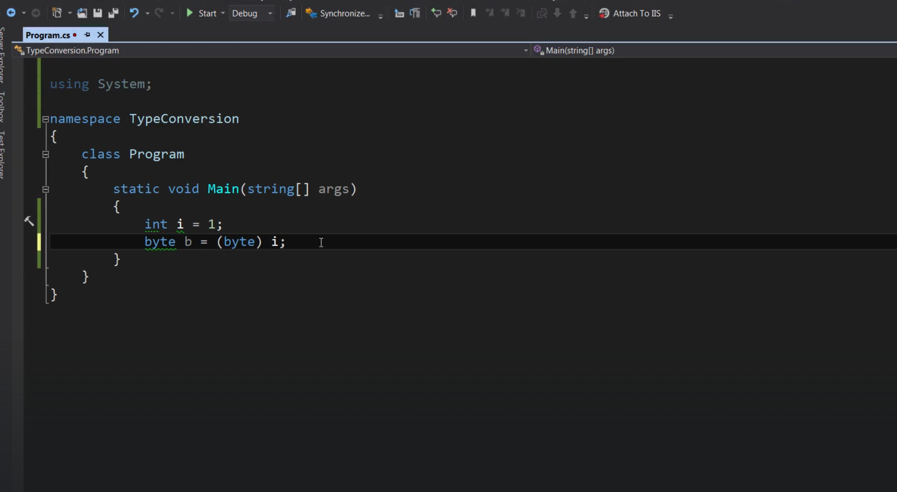

- First lesson

## .NET vs c#

```
*.Net is a framework for building applications on windows and .Net framework is not limited to C# There are different languages that can targeted that framework for example using c# or VP.NET.

* What exactly are .Net Framework .Net Framework consist of component one is CLR(common language runtime) and the other is class Library for building applications

* C# is a programming language

* CLR is an application that sitting in memory who's job is to translate IL(Intermediate Language) then translate it machine code this process code JIT(Just-in-time compilation).
The process look like that in the picture.
```

## Architecture of .net applications
`VeryImportant To know`
- An applications consist of building bloks of classes. This classes coperate with eachother at run time and as result the applications proved some functionality. 
- What is a class?. A class is an container that has some data which also called attributes and funtions which is also called methods.funtions and methods have behavior. For example the excaute code they do things for us. data represent the state of the applications
- As number of classes in our application grows we need way to orgaize that classes And that where we use Namespace in VS editor.
- So a NameSpace is a container for related classes.
- In real world applications as also this Namespaces grows. We will need diffreant way of partitioning(verdeling) and that when we use an ((Assembly) DLL(dynamically linked library) OR EXE(executable)). An assembly is related container for Namespaces and physically its file on disk which either can be excutable or DLL which stand for dynamically linked library
- So when you compile an application. The comiler build one or more Assemblies depending on how you partition your code.
- What is an Assembly? :A single unit of deployment of .NET applications.

`Summary of the First section`
```
C# vs .NET
C# is a programming language, while .NET is a framework. It consists of a run-time environment (CLR) and a class library that we use for building applications.

CLR
When you compile an application, C# compiler compiles your code to IL (Intermediate Language) code. IL code is platform agnostics, which makes it possible to a take a C# program on a different computer with different hardware architecture and operating system and run it. For this to happen, we need CLR. When you run a C# application, CLR compiles the IL code into the native machine code for the computer on which it is running. This process is called Just-in-time Compilation (JIT).

Architecture of .NET Applications
In terms of architecture, an application written with C# consists of building blocks called classes. A class is a container for data (attributes) and methods (functions). Attributes represent the state of the application. Methods include code. They have logic. That's where we implement our algorithms and write code.

A namespace is a container for related classes. So as your application grows in size, you may want to group the related classes into various namespaces for better maintainability.

As the number of classes and namespaces even grow further, you may want to physically separate related namespaces into separate assemblies. An assembly is a file (DLL or EXE) that contains one or more namespaces and classes. An EXE file represents a program that can be executed. A DLL is a file that includes code that can be re-used across different programs.
```
```c#
using System;// you can see here that system is highlighted because we are using class called console and its defined in system namespace.
// to delete line you use control X
namespace CodeWithMosh0._0
{
    internal class Program
    {
        // static: (Main method is declared as static coming back in future lessons)
        // void: Is the return type or the output of the method. void in c# means nothing, that means this method does not return any value it must contain some code.
        // Main:is Method. So main is the enter point of the application and then CLR execute the code inside main method that is where everything kicks off.
        // (string[] args): methods has input and outputs, so what goes inside parenthesis is the input of the methods, which is called parameter or argument.
        // control X you delete a line or to get rid of directives you can also pres alt + enter and than remove unused directives in file.
        static void Main(string[] args)
        {
            // Console is class which is use to read from console or write data to it.
            // throuw the dot (.) you can access Methods. Methods are indicated by purple cube
            //
            Console.WriteLine("oefening");
        }
    }
}
```
------------

- Second lesson Section Primitive Types and Expressions

## Variables and Constants.
`- Variable is a name given to a storage location in memory.`

`- Constant is an immutable value, that means the value will not be changed and it will remain the same unless you chanage it manually.`

`- In c# to declar variable we start with type followed by identifier and finally semi colen. For example (Int number;)`

`- C# is key sensitive language. For example (int Number = 1; is diffreant than int number;) because Number identifier is diffreant than number.`

`- when you declaer value we can optionally assign value but you dont have to but keep in mind you cannot use valuable unless you initialize it`

`- To declaer contants type. you start with keyword const float(float is the data type) pi(pi is the identifier) = (3.14f;(here you are initializing it with value) note we can not defiend constant without setting its value.) so its const float pi = 3.14f;`

`- Important thing you need to know about identifiers first one is that identifier can not start with NUMBER and an identifier can not inclued whitespace. Identifier can't be a reserved keyword and finally always use meaningfulnames. For example:`

```c#
int 1route; // Wrong
int oneRoute; //correct
string first name; //Wrong
string firstName;//correct
int//Wrong
@int//correct
string fn; //Wrong
string firstName;//correct
```
`- We have some styles for coding in c# and rules of naming. which is:`
- For Exaple:


`- Do not use hungarian notation in c# coz c# community don't like that and it looks ugly instead use:`
```c#
For local variables: Camel Case: int number;
For constants: Pascal Case: const int MaxZoom = 5;
```
`- Here is the most commnally use primitive types in c#`

`- Real Numbers has certain use in coding. so when you use Real Numbers you need to add suffix to you code otherwise it might confuse you code and com across problems for example you need float and coz you forgot the suffix c# thought its double. In deep you use it like that so always be specific:`

```c#
float number = 1.2f // you see here f is the suffix and that is the identifier and specification of the number
decimal number = 1.2m // specification is the m mean decimal.
// so if you don't add the suffix, the c# compiler will automatically think its double because it's set so in default
```
- Third Lesson overflowing and Scope
## Overflow
```c#
// as you can see here we know that byte can not take more than range 255 here we adding 1 above. 
byte number = 255; // so 256 is above the range of 255 that what we call overflow. Although if you run the application it will return value of 0
number = number + 1; //0
```
`- In c# by difault we dont have overflow checking so if we boundary of its underline data type we will get overflow.`
`- if you want to stop the overflowing in your appliaction you will need to use checked{} keyword. For example`
```c#
checked{
    byte number = 255;
    number = number +1;
}
```
`- in that case overflow will not happen in that time instead an exception will be throwen and program will crash unless you handle the exception`
## Scope
`- Scope is where variable / constant has meaning and is accessible`
`- `
```c#
    {// inside this blok I have variable called a and a is accessible anywhere inside this blok and any of its childs. If I go outside of this blok  and try to access a the program will not compile same will applies to other variables.
        byte a = 1;
        {
            byte b = 2;// b is meningful anywhere inside this block or any its childeren
            {
                byte c = 3;
            }
        }
    }
```
- Fourth lesson Variables and Constants in practice.
## Variables and Constants in practice.
`- Here we declaerd a variable but we never set vaule to it that is why the it give us red line that there is something wrong.`


`- As you can see its need to be initialized before we access it. So if we want to complie an appliaction we will get an error in that case`

`- To compile application we use ctrl + shift + B`

`- To fix the initialized error you will need to set a vaule to the variable for example.`

`- If you compile it now you will notice that the build succeeded and you no longer having that error. and if you run the appliaction by ctrl + f5 you will get the 2 on console`

`- Here we add some variables and as you can see we are having erron by the float data type that is because we forgot the suffix and because c# does treat float data as double by default.`

`- So we most always add the suffix explicitly. This way we fix the problem.`

`- So here are some data types and how to use them`

`- if you run the appliaction now with ctrl + f5 you will see the value of each data type`

`- Note that you can decler data types with var keyword. For example`

`- If you see when we are hovring at var its says that is boolen. So c# can recognise which data type is that, but sometimes it might be tricky for example if you use want to get byte it will think its int than you have to identifie it explicitly byte. that is only in some cases but for most of them you good to go`

```c#
using System;

namespace CodeWithMosh0._0
{
    internal class Program
    {
        static void Main(string[] args)
        {
            // "{0} {1}" that is what its call format string. its some kind of string that can be used as some kind of template
            Console.WriteLine("{0} {1}", byte.MinValue, byte.MaxValue);
            //  {0} represent byte.MinValue in that case and {1} represent byte.MaxValue. that what we called arguments.
            // So {0} represent byte.MinValue argument and {1} represent byte.MaxValue argument
            // if you run the appliaction now you will see the a range and that is the range you can store in a byte
            // that is also applies for float for example
            Console.WriteLine("{0} {1}", float.MinValue, float.MaxValue);
        }
    }
}
```
`exmple for Constants variable`

`- As its show here we can not change a const value. That is because we choose to have some kind of safety in that code of line. so in that case pi will always be 3.14f.`
- Fifth lesson Converstion
## Converstion

 `In C# there are three types of converstion  which are:`

`- Implicit type conversion `

`- Explicit type conversion(casting) `

`- Conversion betweeen non-compatible types`

```
If you look at the picture you will see that 1 byte = 1 byte but int - 4 bytes. In that case when we convertert there wont be data loss because it will fill the rest of the bytes with zeros

So in situations like that when the compiler is 100% sure that the types are compatible and no data loss will happen values can be converted into other types implicitly.
```


`Lets take look at second exapmle`


```
Now we are trying to compile int to byte so we are going from 4 bytes to 1 so there will be data loss. For that data loss reason the compiler wont complie unless you need explictly tell the complier that you are aware of the data loss and still want to go ahead with converstion. If that so than you will need to prefix the variable with target type. That is also what we call as casting
```
```
data loss example. If you run the application right now there will be data loss for sure coz byte can take only 256 max
```

```
Example for casting
```


`Sometimes you need to work with types which are not compitable just like this case here under, but we still need to converted.`

`In that case we can not use explicit type conversion for that reason we need to use mechanism. So in that case we will use the convert class or parse method. Here are the convert types of convert mechanism`

```
Example for converts with no crashing or data loss.
```

```
In that picture you can see that we have large number above the 256 byte in that case if we run the application. The application will crash than we need to handle it in certain way.
```

```To handle application crash we will need to use the Try method.```

```
In that case we will get friendly message and the application wont crash.
```
- The sixth lesson
## Operators
```
- Operators has 5 types and each type behave differently. So sometimes you need to be precisely.
- Here under you can see the type of each operator.
```

  - To be more clear here are some examples


## (Non-pirmitive types)
## Classes
```
- Classes are building blocks of our applications. A class combines related variables (also called fields, attributes or properties) and functions (methods) together. 

- An object is an instance of a class. At runtime, many objects collaborate with each other to
provide some functionality. As a metaphor, think of a supermarket. At a supermarket, there are
multiple people working together to provide services to customers. Each person has a role and is
focused only on one area of functionality. Software is exactly the same. A role in a supermarket
is like a class in a C# application. A person filling that role during work hours, is like an object in
an application at runtime. 
```
```c#

// To create a class:

public class Person
{

}
// Here, public is what we call an access modifier. It determines whether a class is visible to other classes or not.

// Here is a class with a field and a method:
public class Person
{
    // string Name is a field
 public string Name;
    // this is how we declare a method
 public void Introduce()
    // Here void means this method does not return a value
 {
 Console.WriteLine(“My name is “ + Name);
 }
//To create an object, we use the new operator:
//We use the new operator to allocate memory to an object.
Person person = new Person();
//Once we have an object, we can access its fields and methods with the dot notation:
Person person = new Person();
person.Name = “Mosh”;
person.Introduce();
}
```
- My example
- To move files and to create using file or references you use (alt & enter) that will give you options that can be useful.
```c#
// I careted file here and inside the file I made a class
// That class is accessible because its public class and I made sure that I also changed the namespace to be correct and accessible in program.
using System;
using System.Collections.Generic;
using System.Linq;
using System.Text;
using System.Threading.Tasks;

namespace CodeWithMosh0._0.Math
{
    public class Calculator
    {
        public int Add(int a, int b)
        {
            return a + b;
        }
    }
}
```
```c#
// here I wrote this class at program.cs but than I moved it to other file with resharper because if real life application you will have 1000 of classes that can lead the program to crash that why this is a good practice
using System;

namespace CodeWithMosh0._0
{
    public class Person
    {
        public string FirstName;
        public string LastName;

        public void Introduce()
        {
            Console.WriteLine("My name is " + FirstName + " " + LastName);
        }
    }
}
```
```c#
// here I declaerd what files am using
// here am using file CodeWithMosh0._0.Math;
using CodeWithMosh0._0.Math;
// here am using the system
using System;

namespace CodeWithMosh0._0
{
    internal class Program
    {
        static void Main(string[] args)
        {
            // here I created an object
            var Ghost = new Person();
            //calling Fields
            Ghost.FirstName = "AbdulRahman";
            Ghost.LastName = "Bani Almarjeh";
            // calling the methods
            Ghost.Introduce();
            // using the class from other file and initialize it
            Calculator calculator = new Calculator();
            // here am caling the class
            var result = calculator.Add(1, 2);
            Console.WriteLine(result);
        }
    }
}
```
```c#
// Keep in mind that a struct (structure) is a type similar to a class. It combines related fields and methods together.
// This how you create a struct
public struct RgbColor
{
 public int Red;
 public int Green;
 public int Blue;
}

// why we use struct for?

// Use structs only when creating small lightweight objects. That is for a subtle performance optimization. In the real-world, 99% of the time, you create new types using classes, not structures. 
// In .NET, all primitive types are declared as a structure. They are small and lightweight. The biggest primitive type doesn’t take more than 16 bytes. 
```
## Arrays
- What is an array: An array is a data structure that is used to store a collection of variables of the same type. 

```c#
//For example, instead of declaring three int variables (that are related), we can create an int array like this:
// normal example
int number 1;
int number 2;
int number 3;

//Aarry example
int[] numbers = new int[3];

int[] // here you are telling the compiler that you are declaring an array by using square bracket

new int [3]
// An array in C# is actually an instance of the Array class. So, that’s why here we have to use the (new) operator to allocate memory to this object

//Here, the number 3 specifies the size of the array. Once an array is created, its size cannot be
//changed. If you need a list with dynamic size, you need to use the List class (explained later in the course). 

// To access elements in an array, we use the square bracket notation:

numbers[0] = 1;
numbers[1] = 2;
numbers[3] = 3;

//Note that in C# arrays are zero-indexed. So the first element has index 0.
// If you know in heads of time you can use  object initialism syntex and make this code shorter like that
int  [] numbers = new int [3] {1, 2, 3};
```
- My examples in array
```c#

namespace CodeWithMosh0._0
{
    internal class Program
    {
        static void Main(string[] args)
        {
            var Ghost = new Person();
            Ghost.FirstName = "AbdulRahman";
            Ghost.LastName = "Bani Almarjeh";
            Ghost.Introduce();
            Calculator calculator = new Calculator();
            var result = calculator.Add(1, 2);
            Console.WriteLine(result);

            // you can type it like that but its better to write shorter by using the var key word.
            //Example1
            int[] PlayersInLobby = new int[5];
            PlayersInLobby[0] = 1;
            PlayersInLobby[1] = 2;
            PlayersInLobby[2] = 3;
            PlayersInLobby[3] = 4;
            PlayersInLobby[4] = 5;

            Console.WriteLine("Amount of dead player in lobby" + " " + PlayersInLobby[0]);
            Console.WriteLine("Amount of dead player in lobby" + " " + PlayersInLobby[1]);
            Console.WriteLine("Amount of dead player in lobby" + " " + PlayersInLobby[2]);
            Console.WriteLine("Amount of dead player in lobby" + " " + PlayersInLobby[3]);
            Console.WriteLine("Amount of dead player in lobby" + " " + PlayersInLobby[4]);

            //Example2
            // The compiler also know that PlayerInLobbY are assing into an int array. 
            //So there no need to repeat it twice.
            var PlayersInLobbY = new int[5] { 1, 2, 3, 4, 5 };
            for (int i = 0; i < PlayersInLobbY.Length; i++)
            {
                Console.WriteLine("There are" + " " + PlayersInLobbY[i] + " " + "player in lobby");

            }
        }
    }
}

```

## String
- A string is a sequence of characters. In C# a string is surrounded by double quotes, whereas a character is surrounded by a single quote. 
------
```c#
//For example
string name = “Ghost”;
char ch = ‘A’;
// There are a few different ways to create a string:

//Using a string literal:
string firstName = “Mosh”;

// Using concatenation: useful if you wanna combine two or more strings.

string name = firstName + “ “ + lastName; 

// Using string.Format: cleaner than concatenating multiple strings since you can see the output.

string name = string.Format(“{0} {1}”, firstName, lastName);

// Using string.Join: useful when you have an array and would like to join all elements of that array with a character:

var numbers = new int[3] { 1, 2, 3 }
string list = string.Join(“,”, numbers);
```
- Note: C# strings are immutable, which means once you create them, you cannot change their value or
any of their characters. The String class has a few methods for modifying strings, but all these
methods return a new string and do not modify the original string.
- If you want to escape a character or start new line you can make use of this table here under. This is how you can start new lines and modify the style of you strings.

- 
- Since the backslash character is used to prefix escape characters, if you want to use the
backslash character itself in your string (eg path to a folder), you need to prefix it with
another backslash:
```c#
//For example
string path = “c:\\folder\\file.txt”;
```
- Verbatim Strings
Sometimes if there are many escape characters in a string, that string becomes hard to
read and understand. 
```c#
//For example
var message = “Hi John\nLook at the following path:c:\\folder1\
\folder2”;
```
-Note the \n and double backslashes (\\) here. We can re-write this string using a
verbatim string. We simply prefix our string with an @ sign, and get rid of escape
characters:

- Here are some practie strings in action
```c#
using CodeWithMosh0._0.Math;
using System;

namespace CodeWithMosh0._0
{
    internal class Program
    {
        static void Main(string[] args)
        {
            var firstName = "AbdulRahman";
            var lastName = "Bani Almarjeh";
            var fullName = "My name is" + " " + firstName + " " + lastName;
            Console.WriteLine(fullName);
            var myFullName = string.Format("My name is {0} {1}", firstName, lastName);
            Console.WriteLine(myFullName);
            var names = new string[3] { "John", "Kyle", "Ghostsy" };
            for (int i = 0; i < names.Length; i++)
            {
                Console.WriteLine(names[i]);
            }
            var formattedNames = string.Join(", ", names);
            Console.WriteLine(formattedNames);

        }
    }
}
```
-----
## Enums
- An enum is a data type that represents a set of name/value pairs. Use enums when you need to
define multiple related constants. 
```c#
public enum ShippingMethod
{
 Regular = 1,
 Express = 2
}
// Now we can declare a variable of type ShippingMethod enum and use the dot notation to initialize it:

var method = ShippingMethod.Express;

// Enums are internally integers. So you can easily cast them to and from an int: 


```

```c#
namespace CodeWithMosh0._0
{
    public enum ShippingMethod
    {
        RegularAirMail = 20,
        RegisteredAirMail = 50,
        Express = 100
    }


    internal class Program
    {
        static void Main(string[] args)
        {
            var method = ShippingMethod.Express; 
            Console.WriteLine((int)method); // Here we check the value of the ShippingMethod.Express by casting them
            var methodId = 100; // here we got a number from third party lets say and we want to convet that int to our shippingmethod in our application. again we will use casting.
            // as you can see here under
            Console.WriteLine((ShippingMethod)methodId);
            // This two examples to convert enum to and from intger 

            // Sometiems we need to convert enum to a string or get string and convert it to enum

            // By calling Tostring we can can convert it to a string
            Console.WriteLine(method.ToString());
            // Here we have string and we want to convert to an enum because we have that string stored an database somewhere.

            // here we convert methodname to a Sgippingmethod
            var methodName = "Express";

            // here where it comes pasring. there are some parsing types that has its own overlord and its requires.
            // this is how we parse string to a Enum 
            var shippingMethod = (ShippingMethod)Enum.Parse(typeof(ShippingMethod), methodName);
            Console.WriteLine(shippingMethod);

        }
    }
}
```
## Reference Types and Value Types
- In C#, we have two main types from which we can create new types: classes and
structures (structs).
- Classes are Reference Types while structures are Value Types.

- Value Types
`When you copy a value type to another variable, a copy of the value stored in the
source variable is taken and stored in the target variable. Hence, these two variables
will be independent. See example 1`
- Note that: Primitive types are structures so they are value types. Any custom structure
you define will also be a value type.
- Reference Types
`With a reference type, however, the reference (or memory address) of the object is
copied to the target variable. This means: if you copy a reference type to another
variable, any changes you make to the object referenced by either of these variables,
will be visible through the other variable. See example 2`
----
`Remember: arrays and strings are classes, so they are reference types. Any custom
classes you define will also be a value type.`
---
```c#
using CodeWithMosh0._0.Math;
using System;

namespace CodeWithMosh0._0
{
    internal class Program
    {
        static void Main(string[] args)
        {
            //example 1
            var a = 10; // a is 10
            var b = a; 
            b++; // b is 11
            //Here, incrementing b does not impact a. 
            // its because  these two variables are independent coz they are vaule types
            Console.WriteLine(string.Format("a, {0}, b {1}", a, b));

            // example 2
            // unlike here arrays are r
            var array1 = new int[3] { 1, 2, 3 };
            var array2 = array1;
            array2[0] = 0;
            Console.WriteLine(string.Format("array1[0], {0}, array2[0] {1}", array1[0], array2[0]));
            // Here, both array1 and array2 reference (or point) the same array object in memory. So, 
            //after the third line, the first element of both array1 and array2 will be 0. 
        }
    }
}
```
-------------------
## Conditional Statements
`In c# we have two types of statemnts and conditonal operator see here under.`
- if / else statemeants
- Switch / case statements
- Conditional operator: a ? b : c

```c#
    // if & else examples
    // here depending on the hour the condition will be executed

    internal class Program
    {
        static void Main(string[] args)
        {
            int hour = 10;

            if (hour > 0 && hour < 12)
            {
                Console.WriteLine("it's morning.");
            }
            else if (hour > 12 && hour < 18)
            {
                Console.WriteLine("It's afternoon.");
            }
            else if (hour > 18 && hour < 24)
            {
                Console.WriteLine("It's evening.");
            }
            else Console.WriteLine("it's night.");

            // example 1
            bool isGoldCustormer = true;
            float price;
            if (isGoldCustormer)
            {
                price = 100;
            }
            else price = 1000;
            // example 2 same as example 1 but here we used shortcuts
            float price1 = (isGoldCustormer) ? 100 : 1000;
            Console.WriteLine(price);
            Console.WriteLine(price1);

            // Switch & case in action
            var season = Season.Autumn;
            switch (season)
            {
                case Season.Autumn:
                    Console.WriteLine("Its autmun and a beautiful season");
                    break;
                case Season.Summer:
                    Console.WriteLine("It's perfect to go to beach");
                    break;
                default:
                    Console.WriteLine("What is that season now");
                    break;
            }
        }
    }
```
## Iteration Statements
- Iteration statement are loops and they are four types of for loop here under you can see the example.
- Iteration statemnts are used for repeatedly existedly sequence of statement
```c#
// for loops has three part
for (var i =0; )// first part which also we call the initializtion clause that is where a counter for controling the number of times the loop will be excuted
(var i 0; i < 10; )// second part  what we can the conditon clause the for loop here will be excuted as long as this condation is vaild
(var i = 0; i < 10; i++){"here we have sequence of statement that will excute repetedly"} // thrid part what we call the iteration clause here where we increment or decrement the counter varaible

// for loop in action

namespace CodeWithMosh0._0
{
    internal class Program
    {
        static void Main(string[] args)
        {
            // Here we are using a loop to increment  

            for (var i = 1; i < 12; i++)
            {
                if (i % 2 == 0)
                {
                    Console.WriteLine(i);
                }
            }

            // Here are doing the same but reversing from 12 to 1 

            for (var i = 10; i > 1; i--)
            {
                if (i % 2 == 0)
                {
                    Console.WriteLine(i);
                }
            }
        }
    }
}

```
```c#
// foreach is used to to iterate over elemeant immutable object
// that meant anything that has some kind of list or array nature they are immutable object.
// this how foreach loop looks like.
foreach (var name in names){...}
//name is local or temporary variable
// in keyword 
// names are the object that we are iterating
// carrly breckts where we have some condations 

// forrach in action

namespace CodeWithMosh0._0
{
    internal class Program
    {
        static void Main(string[] args)
        {

            // Here in this exmaple we are looping throght an array with foreach loop
            // using foreach for immutable arrays string are very useful and easy to use.
            var numbers = new int[] { 1, 2, 3, 4, 5 };
            foreach (var number in numbers)
            {
                Console.WriteLine(number);
            }           
            // We can loop thorgh a immutable object wiht for but its way easier to use foreach
            // this two example are exactly the same.
            var name = "Ghost";
            for (int i = 0; i < name.Length; i++)
            {
                Console.WriteLine(name[i]);
            }
            foreach (var Letters in name)
            {
                Console.WriteLine(Letters);
            }

        }
    }
}
```
```c#
// whileloops 
while(i < 10)
{
i++
}
// in terms of while loop the condition are in parentheses and as long as vail the loop will excute.

// this is same example as for loop but we are using while
// so if you dont know a head of time how many times you want to loop use while loop
namespace CodeWithMosh0._0
{
    internal class Program
    {
        static void Main(string[] args)
        {
            var i = 0;
            while (i <= 10)
            {
                if (i % 2 == 0)
                    Console.WriteLine(i);

                i++;

            }

        }
    }
}

```
```c#
// do-while loops
// do while loops are slightly diffreant than while loop. With do while loop will the loop will be excuted at least once 
do{
    // blok of statements
    i++ // here is the counter
}while  (i < 10); //here is hour condation.
```
## Random .net framework
- we use random method whenever there is a need to generate random integers by making use of predefined methods
```c#
// For example here, we made use of random method to make random password.
namespace CodeWithMosh0._0
{
    internal class Program
    {
        static void Main(string[] args)
        {
            const int passwordLength = 10;
            var random = new Random();
            var buffer = new char[passwordLength];

            for (var i = 0; i < passwordLength; i++)
            {
                buffer[i] = (char)('a' + random.Next(0, 26));
            }
            var password = new string(buffer);
            Console.WriteLine(password);
        }
    }
}
```
## Arrays In depth
- earlier we learnd about single arrays.
- Here we gonna take look of MultiDimensions-arrays as you can see here under the idea of it
- As you can see here we have two type of multi dimension array.

- This is how we declare, initialize and access an index of a multidimensional rectangular array.

- This is how we declare, initialize and access an index of a multidimensional Jagged array.
- 
- So the difference between creating rectangular and jagged array with following syntax are

- Here under I have learned and tested some future of static method for arrays
```c#
namespace CodeWithMosh0._0
{
    internal class Program
    {
        static void Main(string[] args)
        {
            var numbers = new[] { 1, 2, 3, 4, 6, 5, 7, 8, 9, 10, 11, 12, };
            // To check the length of the array we type
            // By using the .length  here the length method will retrun an intger number about the lenght of the array.
            Console.WriteLine("Length: " + numbers.Length);

            // Sometimes we need to check position of an element in a array and for that we use the IndexOf()
            // note that the index of first element is zero
            var index = Array.IndexOf(numbers, 10);
            Console.WriteLine("Index of 10: " + index); // that why we get here 9 instead of 10.

            // clear method is use 
            Array.Clear(numbers, 0, 2);
            Console.WriteLine("Effect of Clear()");
            foreach (var elements in numbers)
            {
                Console.WriteLine(elements); // note now the first index of the array are now 0 that is the coz of the clear method set them to zero
            }
            // Copy method
            int[] antotherArray = new int[5];
            Array.Copy(numbers, antotherArray, 5);
            Console.WriteLine("Effect of Copy(): ");
            foreach (var item in antotherArray)
            {
                Console.Write(item);
            }
            Console.WriteLine();
            Array.Sort(numbers);
            Console.WriteLine("Effect of Sort()");
            foreach (var I in numbers)
            {
                Console.WriteLine(I);
            }
            Array.Reverse(numbers);
            Console.WriteLine("Effect of Reverse");
            foreach (var r in numbers)
            {
                Console.WriteLine(r);
            }
        }
    }
}
```
## Lists
- we learned that arrays has a fixed size which means once you create them the size can not be changed.


`This is how we declare, initialize and access an index of an list. To create list we use list type and inside the ankle brackets we specify generic parameter and this parameter  specify the type of the list we can create a list of anything for example string, int, char, of any of non-primitive types`
-----
- If you know a head of time the object you like to store in list you can initialize your list by using object syntax as you see up here
- Here under are some useful method for list and example of each method.

```c#

using CodeWithMosh0._0.Math;
using System;
using System.Collections.Generic; //  note here we are using the collections generic coz list are generic types

namespace CodeWithMosh0._0
{
    internal class Program
    {
        static void Main(string[] args)
        {
            // we can create list like that
            var numbers = new List<int>() { 1, 2, 3, 4, 5 }; // we can initialize a heads of time

            numbers.Add(1); // we can call add method to add one object to the list
            numbers.AddRange(new int[3] { 6, 7, 8 }); // we can call addrange to add another list or an array to the list.
            foreach (var number in numbers)
            {
                Console.WriteLine(number);
            }
            Console.WriteLine();
            Console.WriteLine("Index of 1: " + numbers.IndexOf(1)); // here we are checking the fist index of list
            Console.WriteLine("Last index of 1: " + numbers.LastIndexOf(1)); // where here we checking the last index of the list
            Console.WriteLine("Count: " + numbers.Count); // here we are counting how many objects do we have in list 
            for (var i = 0; i < numbers.Count; i++)
            {
                if (numbers[i] == 1)
                {
                    // here we removing all numbers 1
                    numbers.Remove(numbers[i]);
                }

            }
            Console.WriteLine();
            foreach (var number in numbers)
            {
                Console.WriteLine(number); // after looping thorugh the list you can see now that the list has no number 1
            }

            numbers.Clear(); // here we are clearing the list
            Console.WriteLine("Count: " + numbers.Count); // note here that list is 0 coz we already cleared it

        }
    }
}
```
## Working with dates
- How to work with dates and times in c# see in example 1
- How to work with Time span in c# see in example 2
```c#
`example 1`
namespace CodeWithMosh0._0
{
    internal class Program
    {
        static void Main(string[] args)
        {
            var dateTime = new DateTime(2023, 1, 6);
            var now = DateTime.Now;
            var today = DateTime.Today;
            Console.WriteLine("The year now: " + now.Year);
            Console.WriteLine("The hour now:" + now.Hour);
            Console.WriteLine("The minute now: " + now.Minute);
            Console.WriteLine("The second now: " + now.Second);
            Console.WriteLine("The millisecond now: " + now.Millisecond);
            // note that datetime in c# are immutable and to modify the you need to use method add
            var tommrrow = now.AddDays(1);
            var yesterday = now.AddDays(-1);
            Console.WriteLine(tommrrow);
            Console.WriteLine(now.ToLongTimeString());
            Console.WriteLine(now.ToLongDateString());
            Console.WriteLine(now.ToShortDateString());
            Console.WriteLine(now.ToString());
            Console.WriteLine(now.ToString("yyyy-MM-dd HH:mm"));
            // To take look full list of datetime I can take look at 
            // Google  c# datetime format specifer

        }
    }
}
```
`example 2`
```c#
namespace CodeWithMosh0._0
{
    internal class Program
    {
        static void Main(string[] args)
        {
            // this how to create timespan objects
            var timespan = new TimeSpan(1, 2, 3);
            var timespan1 = new TimeSpan(1, 0, 0);
            var timespan2 = TimeSpan.FromHours(1);
            var start = DateTime.Now;
            var end = DateTime.Now.AddMinutes(2);
            var duration = end - start;
            Console.WriteLine("Duration: " + duration);
            // Properties 
            Console.WriteLine("Minutes: " + timespan.Minutes);
            Console.WriteLine("Minutes: " + timespan.TotalMinutes);
            Console.WriteLine("Minutes: " + timespan.TotalHours);

            // Same timespan its immutable once you create it you cant change it
            // Add
            Console.WriteLine("Add example: " + timespan.Add(TimeSpan.FromMinutes(8)));
            Console.WriteLine("Add example: " + timespan.Subtract(TimeSpan.FromMinutes(2)));

            // Converting timespan to string
            Console.WriteLine("ToString: " + timespan.ToString());

            // Converting from string to int by using parse

            Console.WriteLine("Parse: " + TimeSpan.Parse("01:02:03"));


        }
    }
}
 ```
 ## Working with text Strings
- Here am going to learn about text and strings in depth.
- Converting a string to number. See in example 1
- Converting a number to string. See in example 2
- Useful mehtod in Stings.

`In terms of fromating stings we can use some useful method such as: `


`For searching character or string this method can be useful.`


`If you want to create sub string from giving string we use substring method.`


`If you want to replace giving character or substring we use the replace method.`


`Here we have couple of method to check stings if they are null or whilespace.`


`If you want to use split we use split method.`


`Converting String to a number.`


`Converting number to a string.`


- Here are the all the methods in action.
```c#
namespace CodeWithMosh0._0
{
    internal class Program
    {
        static void Main(string[] args)
        {
            var fullName = "AbdulRahman Bani Almarjeh ";
            Console.WriteLine("Trim: '{0}'", fullName);
            Console.WriteLine("Trim: '{0}'", fullName.Trim());// Trim get ride of the white space at beginning of or at the end of string.
            // Note that: We use trim to get ride of whitespaces and sometimes we need use trimp
            // When we get input from user so that we can make a comparison.
            // Otherwise if you want to compare that sting without using trim comparison won't work
            Console.WriteLine("ToUpper: '{0}'", fullName.Trim().ToUpper());
            Console.WriteLine("ToLower: '{0}'", fullName.Trim().ToLower());
            var index = fullName.IndexOf(' ');
            var firstName = fullName.Substring(0, index);
            var lastName = fullName.Substring(index + 1);
            Console.WriteLine("firstName: " + firstName);
            Console.WriteLine("lastName: " + lastName);
            var names = fullName.Split(' ');
            Console.WriteLine("firstName: " + names[0]);
            Console.WriteLine("lastName: " + names[1] + " " + names[2]);

            Console.WriteLine(fullName.Replace("AbdulRahman", "Ghost"));
            Console.WriteLine(fullName.Replace(' ', '_'));

            if (string.IsNullOrEmpty(" ".Trim()))// old method
            {
                Console.WriteLine("Invaild");
            }
            if (string.IsNullOrWhiteSpace(" ")) // new method
            {
                Console.WriteLine("Invaild");
            }

            var userInputExample = "25";
            var age = Convert.ToByte(userInputExample);
            var age1 = Convert.ToInt32(userInputExample);
            Console.WriteLine(age + " " + age1);

            float price = 999.99f;
            var newPrice = price.ToString("C0");
            Console.WriteLine(newPrice);
        }
    }
}
```
## StringBuilder
```c#
namespace CodeWithMosh0._0
{
    internal class Program
    {
        static void Main(string[] args)
        {
            var builder = new StringBuilder();
            builder.Append('-', 5);
            builder.AppendLine();
            builder.Append("GHOST");
            builder.AppendLine();
            builder.Append('-', 5);
            builder.Replace('-', '+');
            builder.Remove(0, 5);
            builder.Insert(0, new string('-', 5));
            Console.WriteLine(builder);
            Console.WriteLine("First Char: " + builder[0]);
        }
    }
}
```
- SuumrizingText
```c#
using CodeWithMosh0._0.Math;
using System;
using System.Collections.Generic;
using System.Text;
// Useful program to summerize summary without cutting words.
namespace CodeWithMosh0._0
{
    internal class Program
    {
        static void Main(string[] args)
        {
            var sentence = "This is really really really long test and I hate traviling with train to germany";
            var summary = SummerizeText(sentence, 23);
            Console.WriteLine(summary);
        }
        static string SummerizeText(string text, int maxLength = 20)
        {
            if (text.Length < maxLength)
            {
                return text;
            }
            var words = text.Split(' ');
            var totalCharacters = 0;
            var summaryWords = new List<string>();
            foreach (var word in words)
            {
                summaryWords.Add(word);
                totalCharacters += word.Length + 1;
                if (totalCharacters > maxLength)
                {
                    break;
                }
            }
            return String.Join(" ", summaryWords) + "..."; 

        }
    }
}
```
## Procedural programming
- Procedural programming: A programming paradigm base on procedure calls such as functions, methods, routine and subroutine.
- We have also (Object-oriented programming) a programming paradigm based on objects(This is for a later lesson).

`By writing code or programming we make method or functions, sometimes we dont want to mix method or logics with visuals for displaying it on console. By separating the code that work with console from the code implement some logic.That makes the code useable in different programs everywhere. That is why procedural programming is very important cuz it makes your code useful not only for one thing but multifunctional.`

## Working With files
- System.IO is very big namespace.
- Here we are going to cover some useful in

- Here we going to exrpiance how we work with some of this useful method.
- Fileinfo: provides instance methods
- File: provides static methods
- Here there pretty useful method this classes this not complet list The complet list can be found at MC
-----


`Exmples of this useful Methods`


- Directory and directoryinfo are very similar to file and fileinfo
- Directory provides static methods
- Directoryinfo provides instance methods
- Here there are some useful methods


`Exmples of this useful Methods`


- We also have the (Path class)which provides methods to work with strings that contents a file or directory path information


`Exmples of this useful Methods`

## Debugging in depth
| keyboard Shortcuts  | Why I use it for |
| :----- | :----- |
| F9 | To put or remove a breakpoint on code line |
| F5 | Run in debug mode or to step to another breakpoint |
| Ctrl + F5 | Run without debug mode |
| F10 | To step over in code line |
| F11 | To step into the code line|
| Shift + F11 | To step out the code line|
| Ctrl + d + l | To op the local window |
| Ctrl + d + w | To open watch window |
| Ctrl + shift + f9 | To delete all breakpoint |
| Ctrl + d + b | To open breakpoint window |
| Ctrl + d + c | To open call stack window |
| Ctrl + shift + F5 | To restart the application |
## Codeing Mosh exercises
```c#
1- Write a program to count how many numbers between 1 and 100 are divisible by 3 with no remainder. Display the count on the console.

2- Write a program and continuously ask the user to enter a number or "ok" to exit. Calculate the sum of all the previously entered numbers and display it on the console.

3- Write a program and ask the user to enter a number. Compute the factorial of the number and print it on the console. For example, if the user enters 5, the program should calculate 5 x 4 x 3 x 2 x 1 and display it as 5! = 120.

4- Write a program that picks a random number between 1 and 10. Give the user 4 chances to guess the number. If the user guesses the number, display “You won"; otherwise, display “You lost". (To make sure the program is behaving correctly, you can display the secret number on the console first.).

namespace CodeWithMosh0._0
{
    internal class Program
    {
        static void Main(string[] args)
        {
//1
            var number = 0;
            for (int i = 1; i <= 100; i++)
            {
                if (i % 3 == 0)
                {
                    number++;
                }
            }
            Console.WriteLine("There are {0} numbers divisible by 3 between 1 and 100.", number);

//2
            var sum = 0;
            while (true)
            {
                Console.WriteLine("Enter number or type exit to quit!");
                var userInput = Console.ReadLine();
                if (userInput == "exit")
                {
                    break;
                }
                else
                {
                    var storedinfo = int.Parse(userInput);
                    sum += storedinfo;

                }
            }
            Console.WriteLine("{0}", sum);
//3
            Console.WriteLine("Pls enter number you wish: ");
            var userInput = int.Parse(Console.ReadLine());
            var times = 1;
            for (int i = 1; i <= userInput; i++)
            {
                times *= i;
            }
            Console.WriteLine("{0}! - {1}", userInput, times);
//4
            var randomNumber = new Random();
            while (true)
            {
                Console.WriteLine("Guess the number from 1 to 10");
                var storednumber = randomNumber.Next(1, 10);
                var userInput = Console.ReadLine();
                if (userInput == "cheat")
                {
                    Console.WriteLine("cheated {0}", storednumber);
                }
                var userInput0 = int.Parse(Console.ReadLine());
                if (userInput0 != storednumber)
                {
                    Console.WriteLine("Try again");
                }
                var userInput1 = int.Parse(Console.ReadLine());
                if (userInput1 != storednumber)
                {
                    Console.WriteLine("Try again");
                }
                var userInput2 = int.Parse(Console.ReadLine());
                if (userInput2 != storednumber)
                {
                    Console.WriteLine("Try again");
                    break;
                }
                else
                {
                    Console.WriteLine("You gusses the right number");
                    break;
                }

            }
        }
    }
}
```
- Random exercises and knowlage testing.
```c#
1- Random exercise

2- When you post a message on Facebook, depending on the number of people who like your post, Facebook displays different information.

If no one likes your post, it doesn't display anything.
If only one person likes your post, it displays: [Friend's Name] likes your post.
If two people like your post, it displays: [Friend 1] and [Friend 2] like your post.
If more than two people like your post, it displays: [Friend 1], [Friend 2] and [Number of Other People] others like your post.
Write a program and continuously ask the user to enter different names, until the user presses Enter (without supplying a name). Depending on the number of names provided, display a message based on the above pattern.

3- Write a program and ask the user to enter their name. Use an array to reverse the name and then store the result in a new string. Display the reversed name on the console.

4- Write a program and ask the user to enter 5 numbers. If a number has been previously entered, display an error message and ask the user to re-try. Once the user successfully enters 5 unique numbers, sort them and display the result on the console.

//1
            while (true)
            {
                Console.WriteLine("Enter Five numbers To your list!");
                var maxNumber = 0;
                var numbers = new List<int>() { };
                for (int i = 1; i <= 5; i++)
                {
                    var finalNumber = Convert.ToInt32(Console.ReadLine());

                    numbers.Add(finalNumber);
                    if (finalNumber > maxNumber)
                    {
                        maxNumber = finalNumber;

                    }
                }
                Console.WriteLine("The highest number: {0} ", maxNumber);
                Console.WriteLine("The size of the list: {0} ", numbers.Count);
                break;
            }
//2            
            var friendlist = new List<string>();
            while (true)
            {
                Console.WriteLine("Ples enter names as much as you want otherwise type ok to quit");
                var userLikes = Console.ReadLine();
                if (userLikes == "ok")
                {
                    break;
                }
                friendlist.Add(userLikes);
            }
            if (friendlist.Count > 2)
            {
                Console.WriteLine("{0}, {1}, {2}, Liked you photo", friendlist[0], friendlist[1], friendlist[2]);
            }
            else if (friendlist.Count == 2)
            {
                Console.WriteLine("{0},{1} liked your photo", friendlist[0], friendlist[1]);
            }
            else if (friendlist.Count == 1)
            {
                Console.WriteLine("{0} like your photo ", friendlist[0]);
            }
//3         

            Console.Write("What's your name? ");
            var name = Console.ReadLine();

            var array = new char[name.Length];
            for (var i = name.Length; i > 0; i--)
            array[name.Length - i] = name[i - 1];

            var reversed = new string(array);
            Console.WriteLine("Reversed name: " + reversed);

            var personID = new string[2];
            Console.WriteLine("Pls enter you First name and than press enter than enter your last name");
            for (int i = 0; i < personID.Length; i++)
            {
                personID[i] = Console.ReadLine();
            }
            Console.WriteLine("You full name is: " + personID[0] + " " + personID[1]);
//4         
            var numberSotred = new List<int>();
            while (numberSotred.Count < 5)
            {
                Console.WriteLine("Enter five numbers ?");
                var numbersInput = Convert.ToInt32(Console.ReadLine());
                if (numberSotred.Contains(numbersInput))
                {
                    Console.WriteLine("Enter diffreant number you already added that number! ");
                    continue;
                }
                numberSotred.Add(numbersInput);
            }
            numberSotred.Sort();
            foreach (var numbersInput in numberSotred)
            {
                Console.WriteLine(numbersInput);
            }
```
## First part of c# coruse has ended please check the second file.